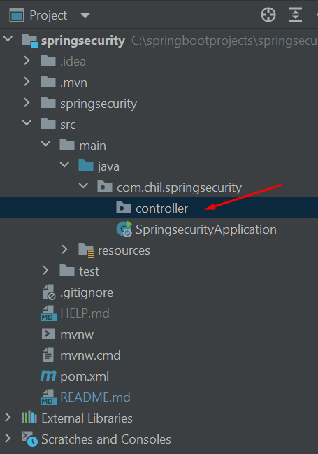
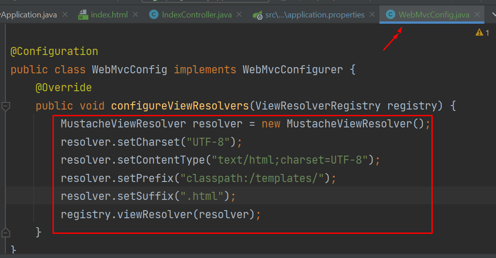
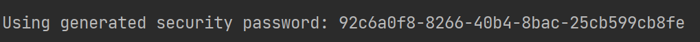

# springsecurity
[Configuration]

[application.properties]
spring.datasource.driver-class-name=com.mysql.cj.jdbc.Driver
spring.datasource.password=1234
spring.datasource.username=root
spring.datasource.url=jdbc:mysql://localhost:3306/security?serverTimezone=UTC
spring.jpa.hibernate.ddl-auto=create
spring.jpa.show-sql = true
spring.jpa.properties.hibernate.dialect = org.hibernate.dialect.MySQL5Dialect
spring.jpa.properties.hibernate.format_sql=true
server.error.include-message=always
[Create controller package]

Using Mustache engine for view. 
mustache default folder is src/main/resources/
TO render .html against Mustache engine, create Config as below

[After running]
Recognized the created encoded password

open browser and will see the login page.
