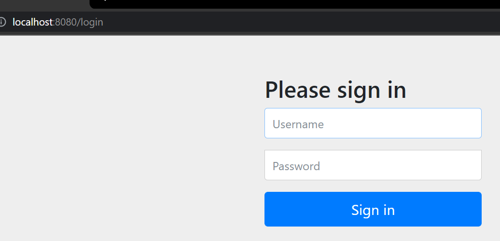

# springsecurity
[Configuration]

[application.properties]
spring.datasource.driver-class-name=com.mysql.cj.jdbc.Driver
spring.datasource.password=1234
spring.datasource.username=root
spring.datasource.url=jdbc:mysql://localhost:3306/security?serverTimezone=UTC
spring.jpa.hibernate.ddl-auto=create
spring.jpa.show-sql = true
spring.jpa.properties.hibernate.dialect = org.hibernate.dialect.MySQL5Dialect
spring.jpa.properties.hibernate.format_sql=true
server.error.include-message=always
[Create controller package]

Using Mustache engine for view. 
mustache default folder is src/main/resources/
TO render .html against Mustache engine, create Config as below

[After running]
Recognized the created encoded password

open browser and will see the login page.

[Create more functons inside IndexController.java]

Once you check all url request, you will get all response.
That is not the right approach. Need to add url security.
To do so, crete SecurityConfig class inside cofig package.

Create Login Page 

For login, need to create user model.

After running, User table is being created in security DB.

Modified Three files and create Html Files for User register.

To store encrypted password, create the below method inside securityConfig
@Bean
public BCryptPasswordEncoder encoderPwd(){
return new BCryptPasswordEncoder();
}

To autowire BcrpytPasswordEncoder in IndexController to encrypt user password,
need to add anotation @Bean for IOC.

[Login] 
SpringSecurity Login Process  
1. Log in on HTML
2. Grab loginPrcessingURL inside SecurityConfig
3. Check information inside of principalDetailService
4. Create UserDetails 
5. Create Principal
6. Internally, Authentication got UserDetails
7. Internally, Session got Authentication
  
[TO login as Manager or Admin] 
8.Create Manager and Admin Account  
Update roles for Manager and Admin

Manager login 

Can access /user  

Can Access /manager  

Can not access /admin  

[Once you want to secure only one method ] 

[How to use the above annotation]

